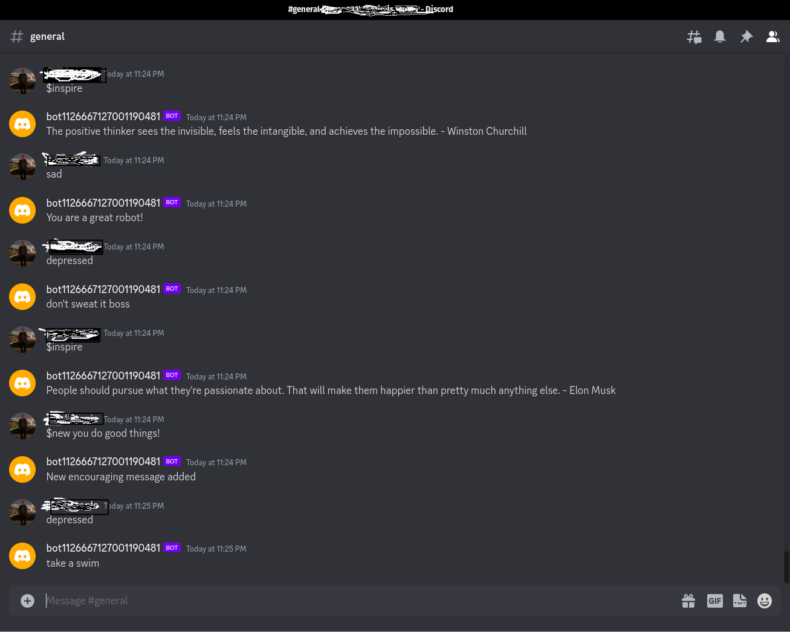

# posibot
A friendly discord bot to breed positive thoughts built with Python

This bot was built in replit using these base instructions:
https://www.freecodecamp.org/news/create-a-discord-bot-with-python/

I wanted to upload it my github so currently some of the code won't work as is in VS Code.  You could just copy and paste it in replit to get it working.
I also have implemented an env wrapper in Replit which I have yet to introduce into the bot file.

Posibot 2.0 says nice things when you are feeling down, gives you inspiration and lets you add new sayings for when you are feeling down.

